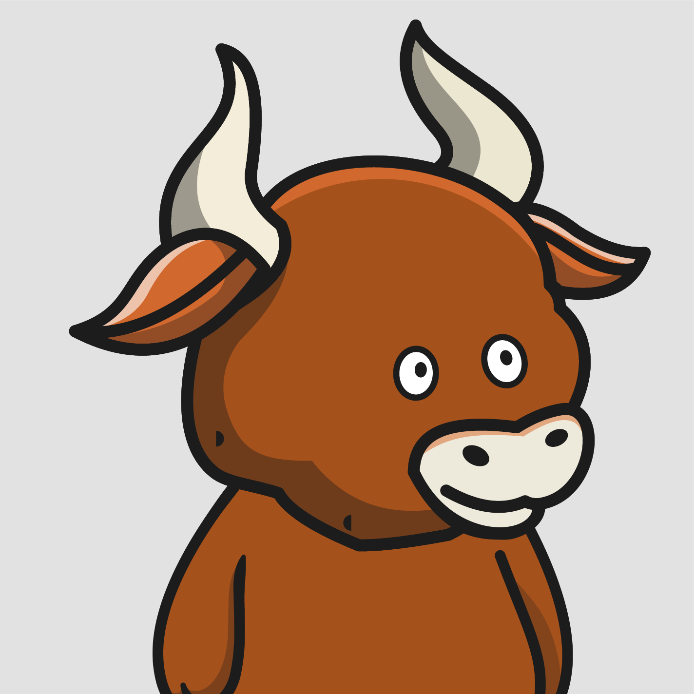

# Dynamic NFTs

## About

Dynamic NFTs that change based on the market price of BTC/USD. When prices go up, it's a bull trend. When prices go down, it's a bear trend.

We run Chainlink Keeper to have our smart contract automatically called at specified intervals.

On-chain logic checks the Chainlink Price Feed to see if there has been a change in price. Accordingly, the minted NFTs dynamically alternate between the images below.

    
    
    
    
    
    

